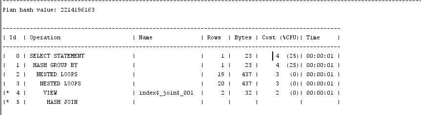

# 第一次实验
#### 18软工三班 王鹏凯

## 实验内容

查看执行计划

查询1

查询2

查询1所用时间比查询2多，查询2查询时所利用的cpu更多,所以查询2比查询1要快

理由:having过滤group by的记录集，弥补了where关键字不能与聚合函数联合使用的不足

2.分别执行两个实例语句后，查看优化计划


根据优化计划对department表创建带排序规则的索引,避免全表扫描


----------------------------------------------------------------
使用左外连接进行两个主键关联表的数据查询。原语句1在执行过程中产生了嵌套循环语句,使得每输出一行都要再查一次该表，所以这时可以采用多表外连接的方式查询
```sql 
SELECT d.department_name,count(e.job_id)as "部门总人数",
avg(e.salary)as "平均工资"
from hr.departments d JOIN hr.employees e
on d.department_id = e.department_id(+)
and d.department_name in ('IT','Sales')
GROUP BY d.department_name;

