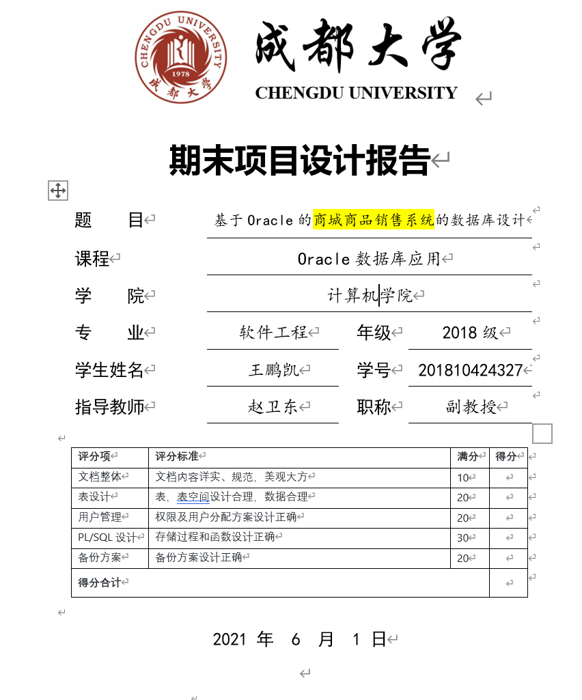

# 1.背景

### 1.1	开发现状

随着如今社会市场竞争的越发激烈，为了提高企业的市场竞争力，减少不必要的各项支出，提高企业管理水平、采用先进高效的管理方法成为了企业发展的必要条件。企业经营产生的购入、支出数据量越发巨大，传统的管理经营方法已经无法满足日益增长的市场需要。因此很多具有较好的网络硬件建设基础的企业开始着手研发电子商品销售系统来逐步取代传统的管理方式。企业通过商品销售系统，可以保证信息处理的及时性与准确性，还可以对商品的购入与销出进行高效的管理。本项目将结合大多中小型企业的现状,以及现有的销售系统情况进行研发。

### 1.2	研究目的

商品的集成销售管理是一家企业进行经营管理的核心内容，在企业管理中占据首要地位。一个企业的经济实力如何，很大程度取决于企业的销售管理效果。利用先进的计算机技术，对企业的销售及销售过程中所涉及的--系列账务关系进行全面细致的跟踪管理，很大程度上解决了人工管理过程中的管理效率低下、数据准确性不高、管理不及时等问题，从而大大提高了企业经营运转的速度，提升企业的管理水平、提高企业的经济效益，使企业的销售管理更加的科学、合理。管理方式的转变，使企业能够及时通过计算机管理系统，对整个销售过程进行数据的统计与分析，并根据分析结果做出必要的调整，使企业在经济浪潮中占据有利地位，更好的适应市场的发展变化。

# 2.开发环境

#### Oracle 12c

Oracle Database，又名Oracle RDBMS，或简称Oracle。是甲骨文公司的一款关系数据库管理系统。它是在数据库领域一直处于领先地位的产品。可以说Oracle数据库系统是目前世界上流行的关系数据库管理系统，系统可移植性好、使用方便、功能强，适用于各类大、中、小、微机环境。它是一种高效率、可靠性好的、适应高吞吐量的数据库方案。

# 3.系统设计

### 3.1.1实体模型

根据应用场最分析，共有3个原始的实体(ntit,它们是部门、员工和产品。
a.部门（DEPARTMENT）：部门包括部门ID(DEPARTMENT JID) 和部门名称(DEPARTMENT NAME)。

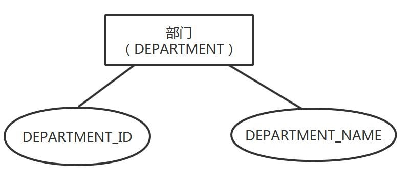

b.员工（EMPLOYEES）：员工包括员工ID(EMPLOYEE ID)，姓名(NAME)，照片(PHOTO)，工资(SALARY)等。员工的属性中还应包括员工所属的部门ID(DEPARTMENT ID),部门ID不能为空，表示员工必须属于某一个部门。 员工的属性中还有员工的上司(MANAGER ID),该属性可以为空，表示没有上司。

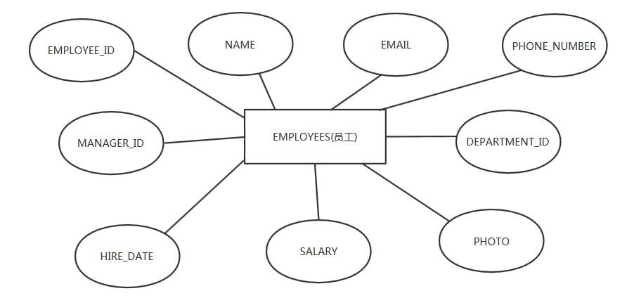

c.产品（PRODUCTS）：产品包括3个属性:产品ID（PRODUCT_ID）产品名称(PRODUCT NAME)和产品类型(PRODUCT TYPE).

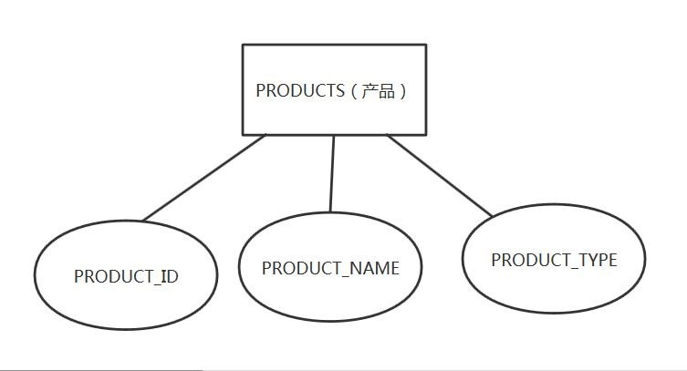

### 3.1.2 实体联系模型

企业员工的工作是销售产品，因此员工和产品之间就有一个“销售”的联系，如图所示，员工与产品之间的关系是多对多的关系 

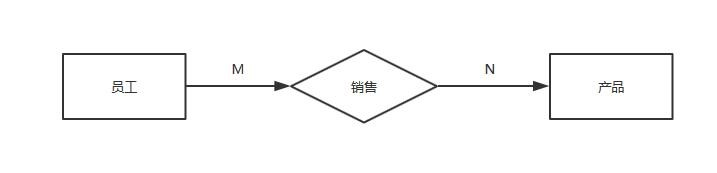

考虑到销售活动中有一些重要属性， 比如折扣，客户信息，销售时间，产品的销售数量和销售价格，我们把销售关系细分为订单和订单详单两个实体，订单中存储:订单ID(ORDER_ ID)、折扣(DISCOUNT)、客户信息(CUSTOMER NAME, CUSTOMER TEL)、订单时间(ORDER DATE)以及应收货款总额(TRADE RECEIVABLE)，订单详单中存储订单详单的ID,以及订单中的全部产品信息，包括:销售数量(PRODUCT NUM)和销售价格(PRODUCT_ PRICE) 

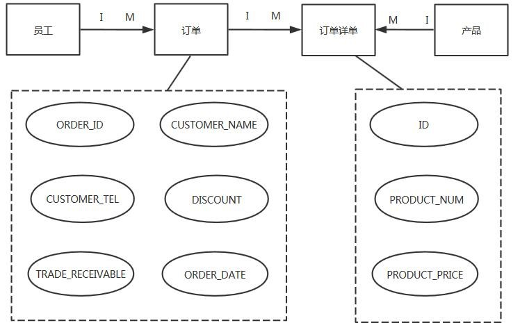

### 3.2数据库表设计

 E-R模型建立好以后，就可以设计Oracle的关系表了。在独立实体中找出主要属性设置为主键，比如在产品表中，产品名称(PRODUCT_ NAME)是主键。由关系派生出的实体中要加入外键关系，比如在图14-5 中有两个一对多的关系，需要增加外键属性，即在订单表中增加员工ID属性(EMPLOYEE ID)，在订单详单中增加产品ID属性(PRODUCT_ ID)。
部门表（DEPARTMENT）包括DEPARTMENT_ID和DEPARTMENT_NAME两个属性。

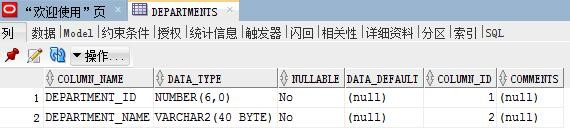

产品表PRODUCTS包括产品ID(PRODUCT_ ID)、产品名称(PRODUCT_ NAME)和产品类型(PRODUCT TYPE)，见表14-2。注意产品表中的产品类型只能取值:耗材，手机，电脑。

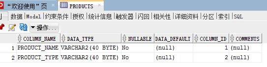

员工表EMPLOYEES包括员工的属性，要注意MANAGER ID 是员工的上司，是员工表EMPOLYEE ID的外键，MANAGER ID不能等于EMPLOYEE_ID，即员工的领导不能是自己。主键删除时MANAGER ID设置为空值。见表14-3。

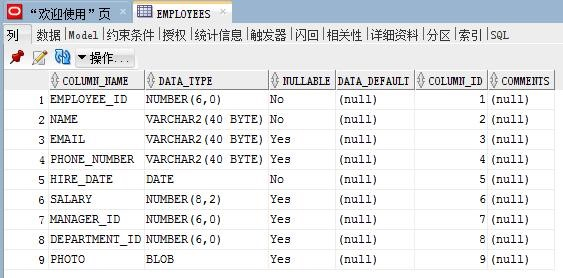

订单表ORDERS是订货信息，见表14-4。表中TRADE_RECEIVABLE是订单的应收货款，是从订单详单表中自动汇总过来的。计算公式是: Trade Receivable= sum(订单详单表.Product Num*订单详单表Product_Price)-Discount。

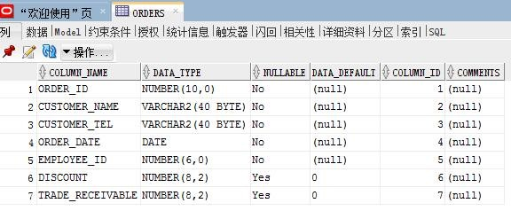

订单详单表ORDER_ DETAILS包含订单中全部产品的信息，见表14-5。要注意，软件系统要通过触发器将产品的金额汇总到订单表中的TRADE_RECEIVABLE属性。

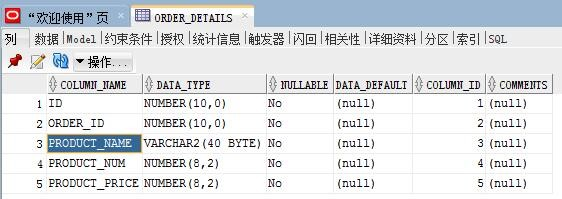

为了使用触发器计算订单的应收货款，需要创建一个临时表ORDER_ID_TEMP,这个表的目的是暂时存储ORDER_ID

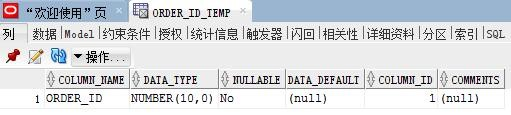

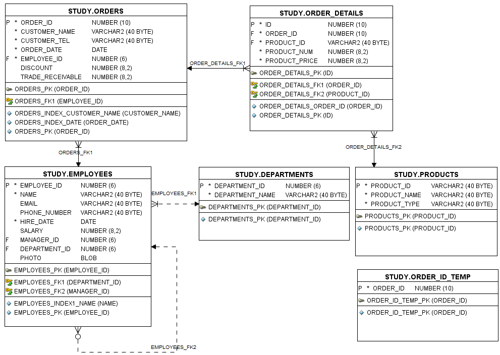

# 4. 详细设计及代码实现
### 4.1用户创建与空间分配：
表的结构设计好之后，还要考虑用户和空间的分配，我们需要为系统新建一个用户（STUDY），在磁盘空间方面，考虑数据存储在PDB上，这里选择Oracle 12c安装时默认的PDBORCL数据库，另外，还需为销售系统创建一个新的表空间USERS02用于存储订单记录。
用户创建与空间分配，创建hld用户

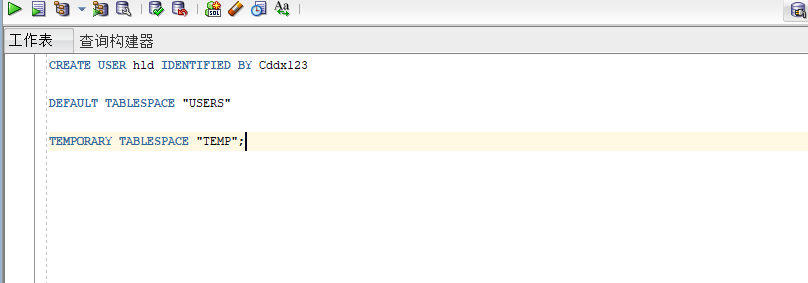

用户分配表空间配额和授权
    
    -- QUOTAS
    ALTER USER STUDY QUOTA UNLIMITED ON USERS;
    ALTER USER STUDY QUOTA UNLIMITED ON USERS02;
    -- ROLES
    GRANT "CONNECT" TO STUDY WITH ADMIN OPTION;
    GRANT "RESOURCE" TO STUDY WITH ADMIN OPTION;
    ALTER USER STUDY DEFAULT ROLE "CONNECT","RESOURCE";
    -- SYSTEM PRIVILEGES
    GRANT CREATE VIEW TO STUDY WITH ADMIN OPTION;

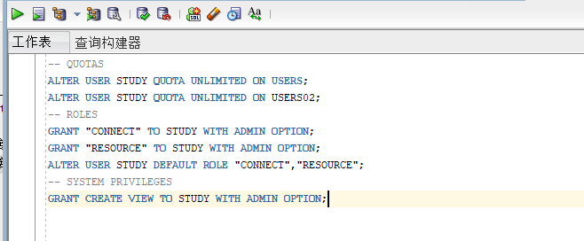

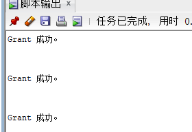

### 4.2创建表、约束和索引

#### 4.2.1创建表

     CREATE TABLE ORDERS 
     (
       ORDER_ID NUMBER(10, 0) NOT NULL 
     , CUSTOMER_NAME VARCHAR2(40 BYTE) NOT NULL 
     , CUSTOMER_TEL VARCHAR2(40 BYTE) NOT NULL 
     , ORDER_DATE DATE NOT NULL 
     , EMPLOYEE_ID NUMBER(6, 0) NOT NULL 
     , DISCOUNT NUMBER(8, 2) DEFAULT 0 
     , TRADE_RECEIVABLE NUMBER(8, 2) DEFAULT 0 
     ) 
     TABLESPACE USERS 
     PCTFREE 10 
     INITRANS 1 
     STORAGE 
     ( 
       BUFFER_POOL DEFAULT 
     ) 
     NOCOMPRESS 
     NOPARALLEL 
     PARTITION BY RANGE (ORDER_DATE) 
    
      PARTITION PARTITION_BEFORE_2016 VALUES LESS THAN (TO_DATE(' 2016-01-01 00:00:00', 'SYYYY-MM-DD HH24:MI:SS', 'NLS_CALENDAR=GREGORIAN')) 
      NOLOGGING 
      TABLESPACE USERS 
      PCTFREE 10 
      INITRANS 1 
      STORAGE 
      ( 
        INITIAL 8388608 
        NEXT 1048576 
        MINEXTENTS 1 
        MAXEXTENTS UNLIMITED 
        BUFFER_POOL DEFAULT 
      ) 
      NOCOMPRESS NO INMEMORY  
    , PARTITION PARTITION_BEFORE_2017 VALUES LESS THAN (TO_DATE(' 2017-01-01 00:00:00', 'SYYYY-MM-DD HH24:MI:SS', 'NLS_CALENDAR=GREGORIAN')) 
      NOLOGGING 
      TABLESPACE USERS02 
      PCTFREE 10 
      INITRANS 1 
      STORAGE 
      ( 
        INITIAL 8388608 
        NEXT 1048576 
        MINEXTENTS 1 
        MAXEXTENTS UNLIMITED 
        BUFFER_POOL DEFAULT 
      ) 
      NOCOMPRESS NO INMEMORY  
    );

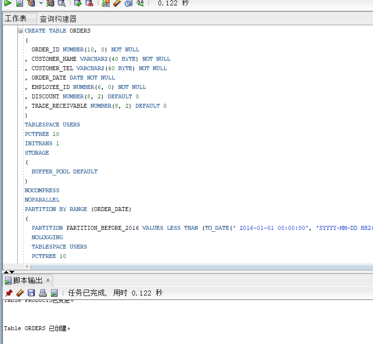

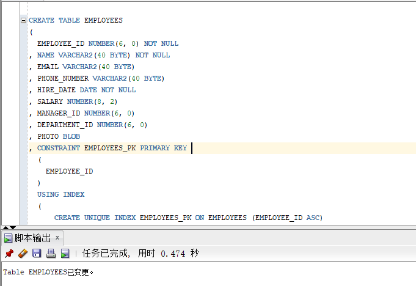

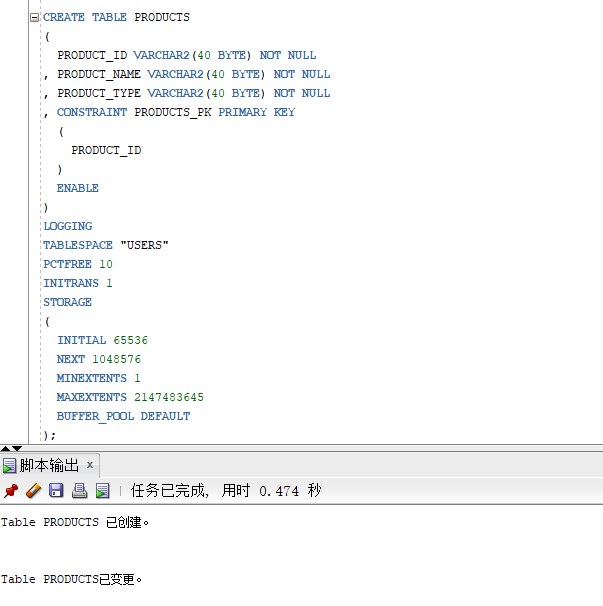

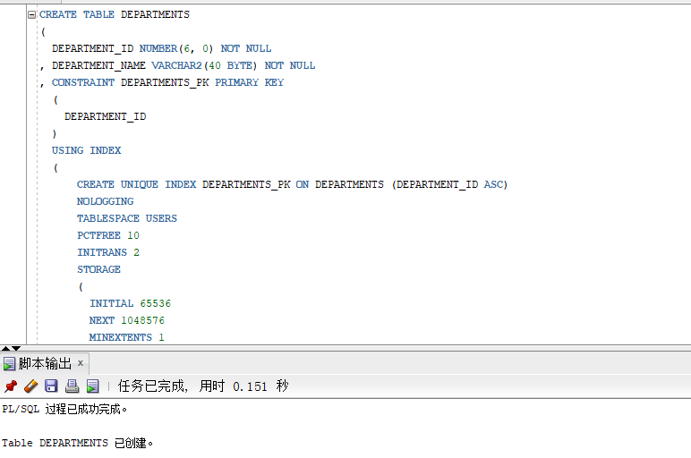

#### 4.2.2创建本地分区索引ORDERS_INDEX_DATE

    CREATE INDEX ORDERS_INDEX_DATE ON ORDERS (ORDER_DATE ASC) 
    LOCAL 
    (
      PARTITION PARTITION_BEFORE_2016 
        TABLESPACE USERS 
        PCTFREE 10 
        INITRANS 2 
        STORAGE 
        ( 
          INITIAL 8388608 
          NEXT 1048576 
          MINEXTENTS 1 
          MAXEXTENTS UNLIMITED 
          BUFFER_POOL DEFAULT 
        ) 
        NOCOMPRESS  
    , PARTITION PARTITION_BEFORE_2017 
        TABLESPACE USERS02 
        PCTFREE 10 
        INITRANS 2 
        STORAGE 
    
        ( 
          INITIAL 8388608 
          NEXT 1048576 
          MINEXTENTS 1 
          MAXEXTENTS UNLIMITED 
          BUFFER_POOL DEFAULT 
        ) 
        NOCOMPRESS  
    ) 
    STORAGE 
    ( 
      BUFFER_POOL DEFAULT 
    ) 
    NOPARALLEL;

 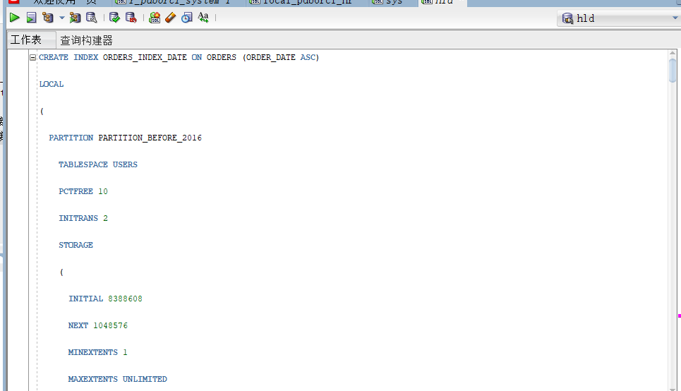  

 #### 4.2.3创建临时表空间

  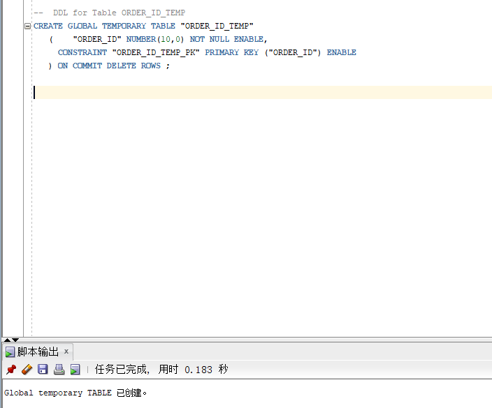

### 4.3创建触发器、序列和视图

#### 4.3.1创建3个触发器

    --------------------------------------------------------
      DDL for Trigger ORDERS_TRIG_ROW_LEVEL
    --------------------------------------------------------
    
    CREATE OR REPLACE EDITIONABLE TRIGGER "ORDERS_TRIG_ROW_LEVEL" 
    BEFORE INSERT OR UPDATE OF DISCOUNT ON "ORDERS" 
    FOR EACH ROW --行级触发器
    declare
      m number(8,2);
    BEGIN
      if inserting then
           :new.TRADE_RECEIVABLE := - :new.discount; 
      else
          select sum(PRODUCT_NUM*PRODUCT_PRICE) into m from ORDER_DETAILS where ORDER_ID=:old.ORDER_ID;
          if m is null then
            m:=0;
          end if;
    
          :new.TRADE_RECEIVABLE := m - :new.discount;
      end if;
    END;
    
    -------------------------------------------------------
    --  DDL for Trigger ORDER_DETAILS_ROW_TRIG
    --------------------------------------------------------
    CREATE OR REPLACE EDITIONABLE TRIGGER "ORDER_DETAILS_ROW_TRIG" 
    AFTER DELETE OR INSERT OR UPDATE  ON ORDER_DETAILS 
    FOR EACH ROW 
    BEGIN
      --DBMS_OUTPUT.PUT_LINE(:NEW.ORDER_ID);
      IF :NEW.ORDER_ID IS NOT NULL THEN
        MERGE INTO ORDER_ID_TEMP A
        USING (SELECT 1 FROM DUAL) B
        ON (A.ORDER_ID=:NEW.ORDER_ID)
        WHEN NOT MATCHED THEN
          INSERT (ORDER_ID) VALUES(:NEW.ORDER_ID);
      END IF;
      IF :OLD.ORDER_ID IS NOT NULL THEN
        MERGE INTO ORDER_ID_TEMP A
        USING (SELECT 1 FROM DUAL) B
        ON (A.ORDER_ID=:OLD.ORDER_ID)
        WHEN NOT MATCHED THEN
          INSERT (ORDER_ID) VALUES(:OLD.ORDER_ID);
      END IF;  
    END;

    -------------------------------------------------------
    --  DDL for Trigger ORDER_DETAILS_SNTNS_TRIG
    --------------------------------------------------------
    CREATE OR REPLACE EDITIONABLE TRIGGER "ORDER_DETAILS_SNTNS_TRIG" 
    AFTER DELETE OR INSERT OR UPDATE ON ORDER_DETAILS 
    declare
      m number(8,2);
    BEGIN
      FOR R IN (SELECT ORDER_ID FROM ORDER_ID_TEMP)
      LOOP
        --DBMS_OUTPUT.PUT_LINE(R.ORDER_ID);
        select sum(PRODUCT_NUM*PRODUCT_PRICE) into m from ORDER_DETAILS 
          where ORDER_ID=R.ORDER_ID;
        if m is null then
          m:=0;
        end if;
        UPDATE ORDERS SET TRADE_RECEIVABLE = m - discount 
          WHERE ORDER_ID=R.ORDER_ID;    
      END LOOP;
      delete from ORDER_ID_TEMP; --这句话很重要，否则可能一直不释放空间，后继插入会非常慢。
    END;

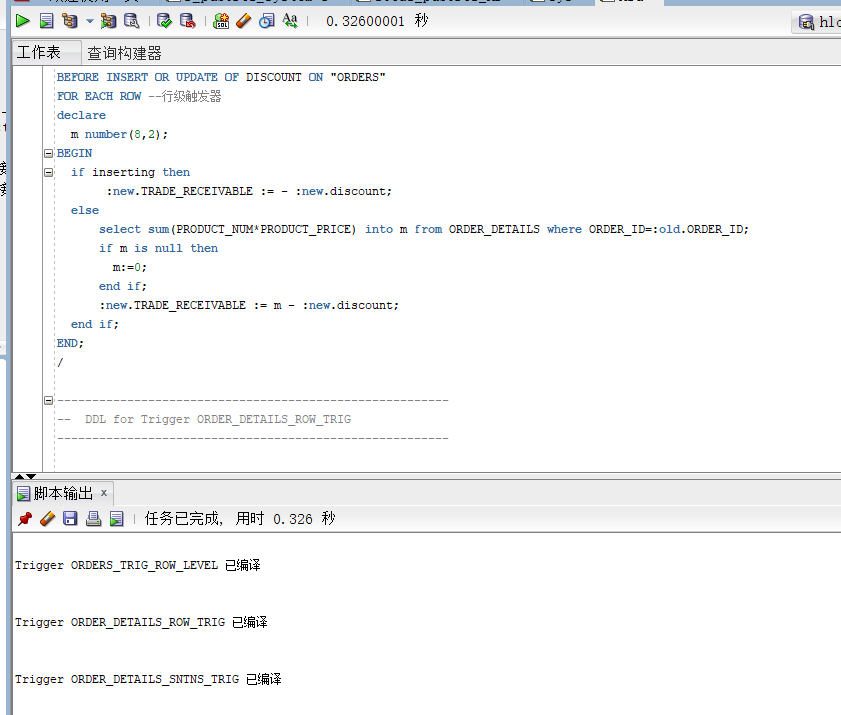

#### 4.3.2创建序列

    --------------------------------------------------------
    --  DDL for Sequence SEQ_ORDER_ID
    --------------------------------------------------------
    CREATE SEQUENCE  "SEQ_ORDER_ID"  MINVALUE 1 MAXVALUE 9999999999 INCREMENT BY 1 START WITH 1 CACHE 2000 ORDER  NOCYCLE  NOPARTITION ;
    
    --------------------------------------------------------
    --  DDL for Sequence SEQ_ORDER_DETAILS_ID
    --------------------------------------------------------
    CREATE SEQUENCE  "SEQ_ORDER_DETAILS_ID"  MINVALUE 1 MAXVALUE 9999999999 INCREMENT BY 1 START WITH 1 CACHE 2000 ORDER  NOCYCLE  NOPARTITION ;

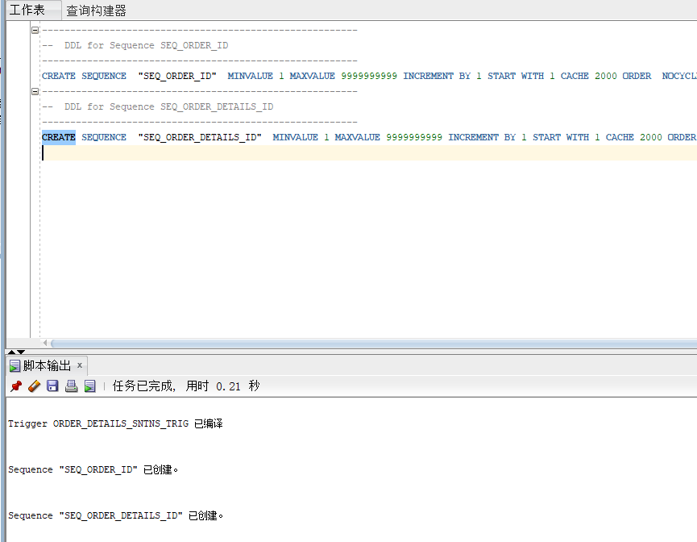

#### 4.3.3创建视图

    --------------------------------------------------------
    --  DDL for View VIEW_ORDER_DETAILS
    --------------------------------------------------------
    CREATE OR REPLACE VIEW VIEW_ORDER_DETAILS
    AS SELECT
      d.ID,
      o.ORDER_ID,
      o.CUSTOMER_NAME,o.CUSTOMER_TEL,o.ORDER_DATE,
      d.PRODUCT_ID,  
      p.PRODUCT_NAME,  
      p.PRODUCT_TYPE,
    
      d.PRODUCT_NUM,
      d.PRODUCT_PRICE
    FROM ORDERS o,ORDER_DETAILS d,PRODUCTS p where d.ORDER_ID=o.ORDER_ID and d.PRODUCT_ID=p.PRODUCT_ID;

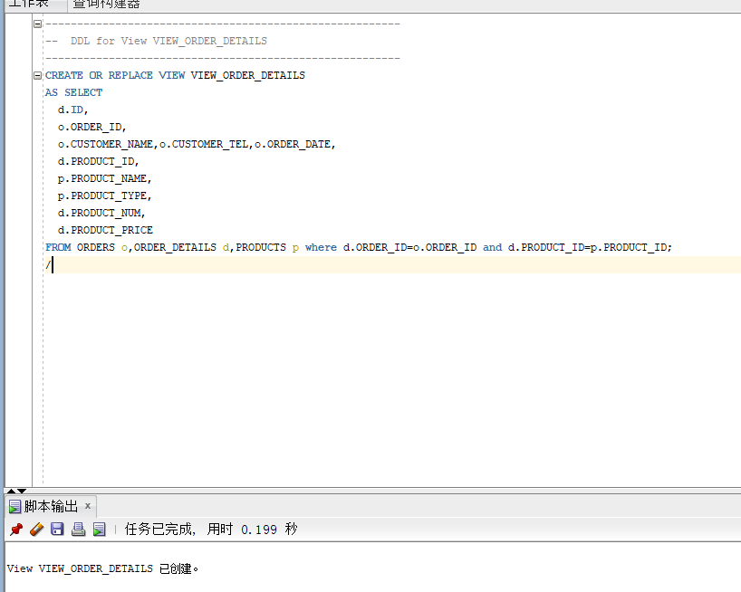

### 4.4插入数据与数据库测试

#### 4.4.1批量插入订单数据之前，禁用触发器

    ALTER TRIGGER "ORDERS_TRIG_ROW_LEVEL" DISABLE;
    ALTER TRIGGER "ORDER_DETAILS_ROW_TRIG" DISABLE;
    ALTER TRIGGER "ORDER_DETAILS_SNTNS_TRIG" DISABLE;

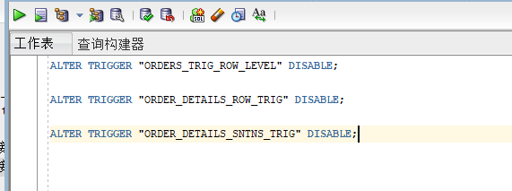

插入DEPARTMENTS，EMPLOYEES数据

    INSERT INTO DEPARTMENTS(DEPARTMENT_ID,DEPARTMENT_NAME) values (1,'总经办');
    INSERT INTO EMPLOYEES(EMPLOYEE_ID,NAME,EMAIL,PHONE_NUMBER,HIRE_DATE,SALARY,MANAGER_ID,DEPARTMENT_ID) 
      VALUES (1,'赵老师',NULL,NULL,to_date('2010-1-1','yyyy-mm-dd'),50000,NULL,1);
    INSERT INTO DEPARTMENTS(DEPARTMENT_ID,DEPARTMENT_NAME) values (11,'销售部1');
    INSERT INTO EMPLOYEES(EMPLOYEE_ID,NAME,EMAIL,PHONE_NUMBER,HIRE_DATE,SALARY,MANAGER_ID,DEPARTMENT_ID) 
      VALUES (11,'陈经理',NULL,NULL,to_date('2010-1-1','yyyy-mm-dd'),50000,1,1);
    INSERT INTO EMPLOYEES(EMPLOYEE_ID,NAME,EMAIL,PHONE_NUMBER,HIRE_DATE,SALARY,MANAGER_ID,DEPARTMENT_ID) 
      VALUES (111,'吴经理',NULL,NULL,to_date('2010-1-1','yyyy-mm-dd'),50000,11,11);
    INSERT INTO EMPLOYEES(EMPLOYEE_ID,NAME,EMAIL,PHONE_NUMBER,HIRE_DATE,SALARY,MANAGER_ID,DEPARTMENT_ID) 
      VALUES (112,'白经理',NULL,NULL,to_date('2010-1-1','yyyy-mm-dd'),50000,11,11);
    INSERT INTO DEPARTMENTS(DEPARTMENT_ID,DEPARTMENT_NAME) values (12,'销售部2');
    INSERT INTO EMPLOYEES(EMPLOYEE_ID,NAME,EMAIL,PHONE_NUMBER,HIRE_DATE,SALARY,MANAGER_ID,DEPARTMENT_ID) 
      VALUES (12,'王总',NULL,NULL,to_date('2010-1-1','yyyy-mm-dd'),50000,1,1);
    INSERT INTO EMPLOYEES(EMPLOYEE_ID,NAME,EMAIL,PHONE_NUMBER,HIRE_DATE,SALARY,MANAGER_ID,DEPARTMENT_ID) 
      VALUES (121,'赵经理',NULL,NULL,to_date('2010-1-1','yyyy-mm-dd'),50000,12,12);
    INSERT INTO EMPLOYEES(EMPLOYEE_ID,NAME,EMAIL,PHONE_NUMBER,HIRE_DATE,SALARY,MANAGER_ID,DEPARTMENT_ID) 
      VALUES (122,'刘经理',NULL,NULL,to_date('2010-1-1','yyyy-mm-dd'),50000,12,12);

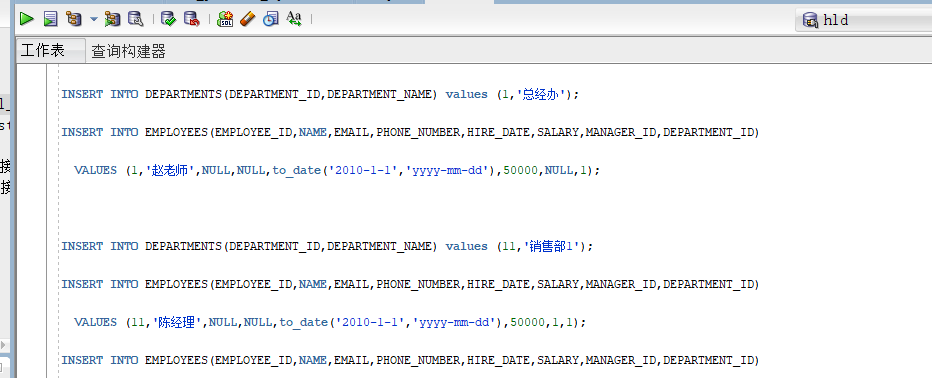

批量插入订单数据

    declare
      dt date;
      m number(8,2);
      V_EMPLOYEE_ID NUMBER(6);
      v_order_id number(10);
      v_name varchar2(100);
      v_tel varchar2(100);
      v number(10,2);
    begin
      for i in 1..10000
      loop
        if i mod 2 =0 then
          dt:=to_date('2015-3-2','yyyy-mm-dd')+(i mod 60);
        else
          dt:=to_date('2016-3-2','yyyy-mm-dd')+(i mod 60);
        end if;
        V_EMPLOYEE_ID:=CASE I MOD 6 WHEN 0 THEN 11 WHEN 1 THEN 111 WHEN 2 THEN 112 
                                    WHEN 3 THEN 12 WHEN 4 THEN 121 ELSE 122 END; 
        --插入订单
        v_order_id:=SEQ_ORDER_ID.nextval; --应该将SEQ_ORDER_ID.nextval保存到变量中。
        v_name := 'aa'|| 'aa';
        v_name := 'zhang' || i;
        v_tel := '139888883' || i;
        insert /*+append*/ into ORDERS (ORDER_ID,CUSTOMER_NAME,CUSTOMER_TEL,ORDER_DATE,EMPLOYEE_ID,DISCOUNT) 
          values (v_order_id,v_name,v_tel,dt,V_EMPLOYEE_ID,dbms_random.value(100,0));    
        --插入订单y一个订单包括3个产品
        v:=dbms_random.value(10000,4000);
        v_name:='computer'|| (i mod 3 + 1);
        insert /*+append*/ into ORDER_DETAILS(ID,ORDER_ID,PRODUCT_ID,PRODUCT_NUM,PRODUCT_PRICE) 
          values (SEQ_ORDER_DETAILS_ID.NEXTVAL,v_order_id,v_name,2,v);
        v:=dbms_random.value(1000,50);
        v_name:='paper'|| (i mod 3 + 1);
        insert /*+append*/ into ORDER_DETAILS(ID,ORDER_ID,PRODUCT_ID,PRODUCT_NUM,PRODUCT_PRICE) 
          values (SEQ_ORDER_DETAILS_ID.NEXTVAL,v_order_id,v_name,3,v);
        v:=dbms_random.value(9000,2000);
        v_name:='phone'|| (i mod 3 + 1);
        insert /*+append*/ into ORDER_DETAILS(ID,ORDER_ID,PRODUCT_ID,PRODUCT_NUM,PRODUCT_PRICE)
          values (SEQ_ORDER_DETAILS_ID.NEXTVAL,v_order_id,v_name,1,v); 
        --在触发器关闭的情况下，需要手工计算每个订单的应收金额：
        select sum(PRODUCT_NUM*PRODUCT_PRICE) into m from ORDER_DETAILS where ORDER_ID=v_order_id;
        if m is null then
         m:=0;
        end if;
        UPDATE ORDERS SET TRADE_RECEIVABLE = m - discount WHERE ORDER_ID=v_order_id; 
        IF I MOD 1000 =0 THEN
          commit; --每次提交会加快插入数据的速度
        END IF;
      end loop;

   

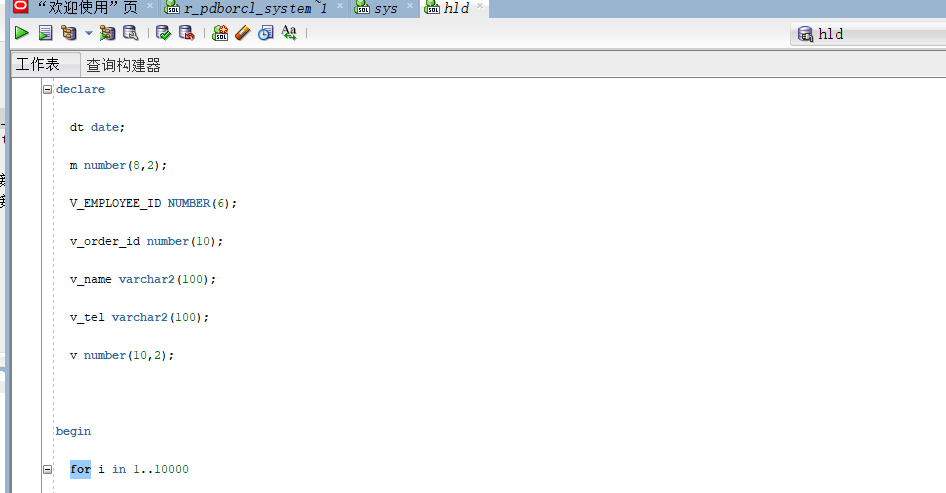

#### 4.4.2数据库测试：

    set serveroutput on
    DECLARE
      V_EMPLOYEE_ID NUMBER;    
    BEGIN
      V_EMPLOYEE_ID := 1;
      MYPACK.Get_Employees (  V_EMPLOYEE_ID => V_EMPLOYEE_ID) ;  
      V_EMPLOYEE_ID := 11;
      MYPACK.Get_Employees (  V_EMPLOYEE_ID => V_EMPLOYEE_ID) ; 
      END;  

  

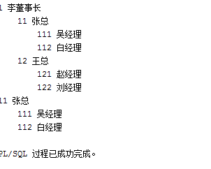

#### 4.4.3查询分区表情况

    select TABLE_NAME,PARTITION_NAME,HIGH_VALUE,PARTITION_POSITION,TABLESPACE_NAME from user_tab_partitions

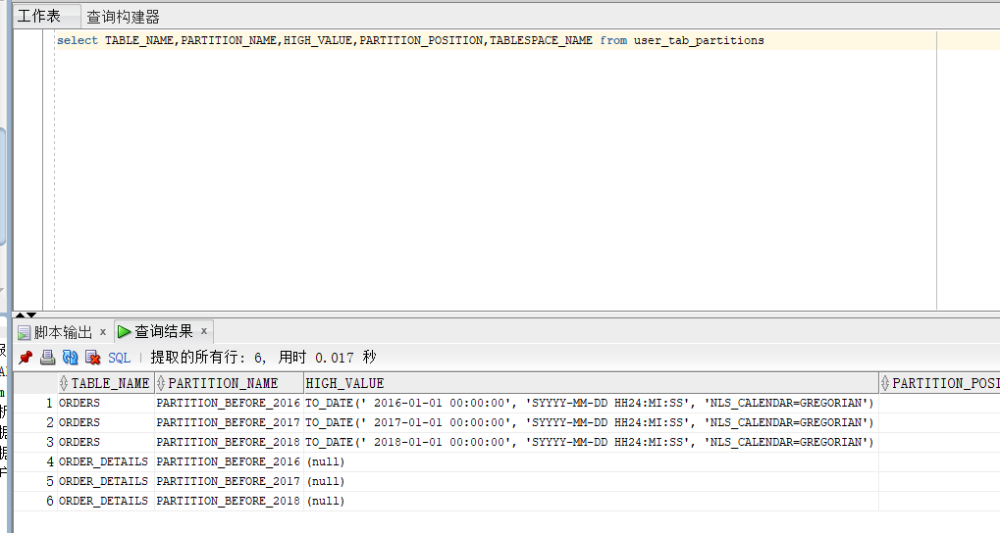

查询分区索引情况

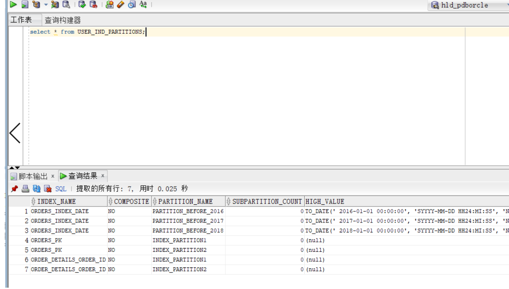

查询一个分区中的数据

    select count(*) from ORDERS partition(PARTITION_BEFORE_2016);
    select count(*) from ORDERS partition(PARTITION_BEFORE_2017);

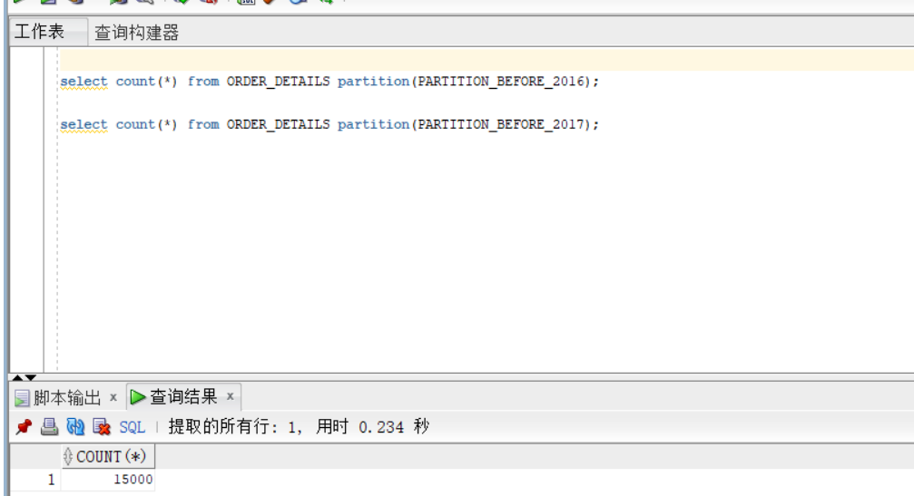

# 5.手工全备份和全恢复

### 5.1.1开始全备份

    [oracle@oracle-pc ~]$ cat rman_level0.sh
    [oracle@oracle-pc ~]$ ./rman_level0.sh

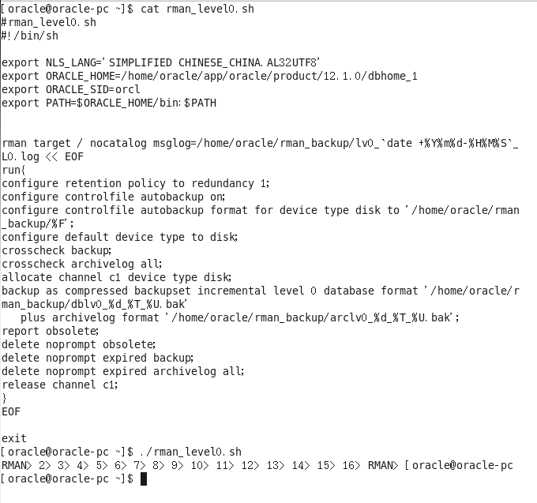

### 5.1.2每天定时开始增量备份（可选）

    [oracle@oracle-pc ~]$ cat rman_level1.sh
    [oracle@oracle-pc ~]$ ./rman_level1.sh

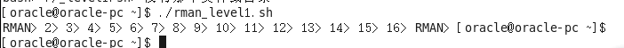

备份后修改数据

    [oracle@oracle-pc ~]$ sqlplus study/123@pdborcl
    SQL> create table t1 (id number,name varchar2(50));
    SQL> insert into t1 values(1,'zhang');1 row created.
    SQL> commit;
    SQL> select * from t1;
    SQL> exit

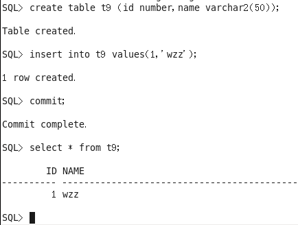

### 5.1.3删除数据库文件

模拟数据库文件损坏（删除数据文件后，仍然可以增加一条数据。这是因为增加的数据并没有写入数据文件，而是写到了日志文件中。如果增加的数据较多的时候，就会出问题了。）

删除

    [oracle@oracle-pc ~]$ rm /home/oracle/app/oracle/oradata/orcl/pdborcl/SAMPLE_SCHEMA_users01.dbf

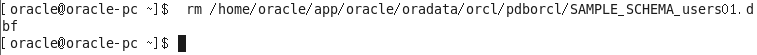

    [oracle@oracle-pc ~]$ sqlplus study/123@pdborcl
    SQL> insert into t1 values(2,'wang');
    SQL> commit;
    SQL> select * from t1;
    SQL> declare
      2  n number;
      3  begin
      4    for n in 1..10000 loop
      5      insert into t1 values(n,'name'||n);
      6    end loop;
      7  end;
    SQL> select * from t1;
    SQL> exit

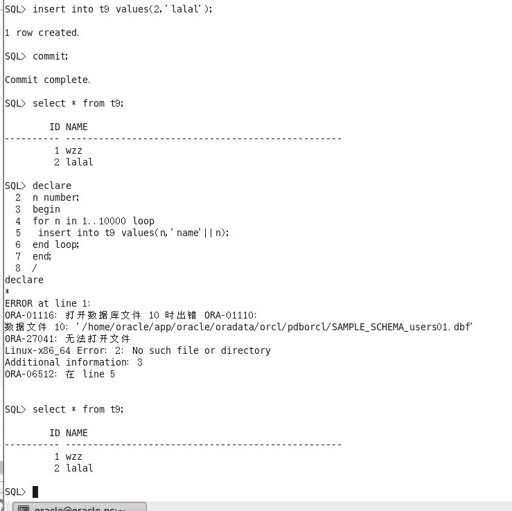

### 5.2开始全恢复

#### 5.2.1重启损坏的数据库到mount状态

-通过shutdown immediate无法正常关闭数据库，只能通过shutdown abort强制关闭。然后将数据库启动到mount状态。

    [oracle@oracle-pc ~]$ sqlplus / as sysdba
    SQL> shutdown immediate
    SQL> shutdown abort
    SQL> startup mount
    SQL> exit

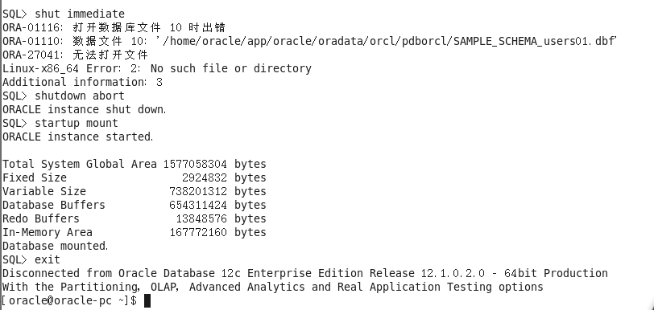

#### 5.2.2开始恢复数据库

    [oracle@oracle-pc ~]$ rman target /
    RMAN> restore database ;
    RMAN> recover database;
    RMAN> alter database open;
    Statement processed
    RMAN> exit
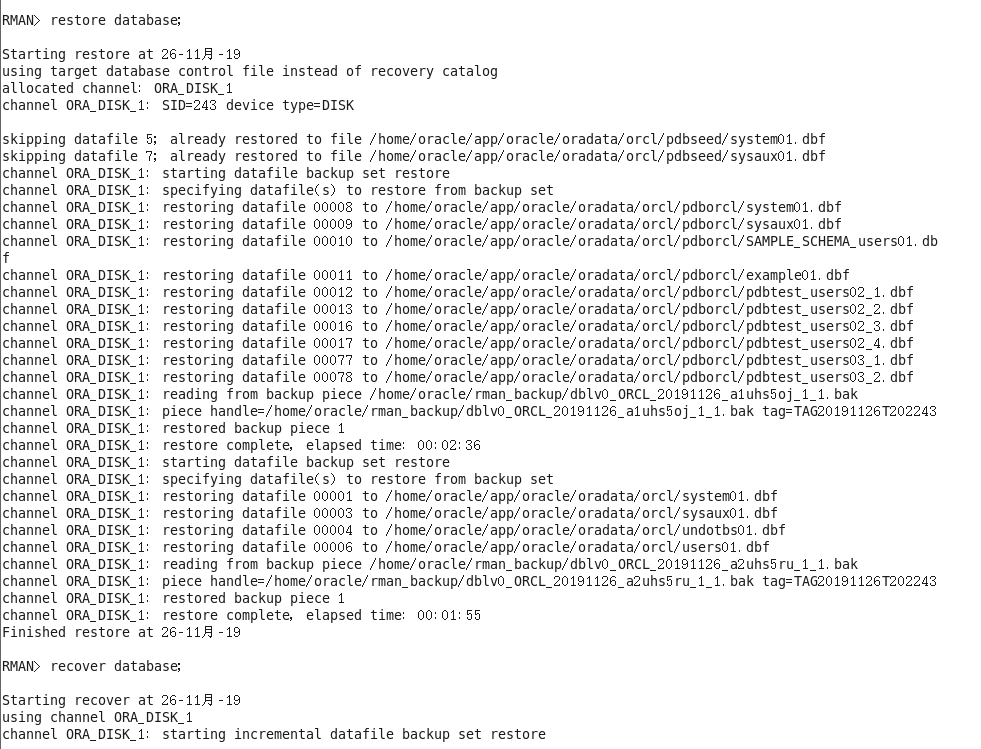

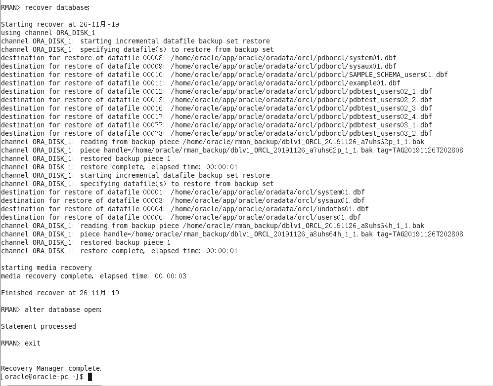

#### 5.2.3

    [oracle@oracle-pc ~]$ rman target /
    RMAN> delete backup;
    RMAN> exit

#### 5.2.4删除备份集（可选）

    [oracle@oracle-pc ~]$ rman target /
    RMAN> delete backup;
    RMAN> exit

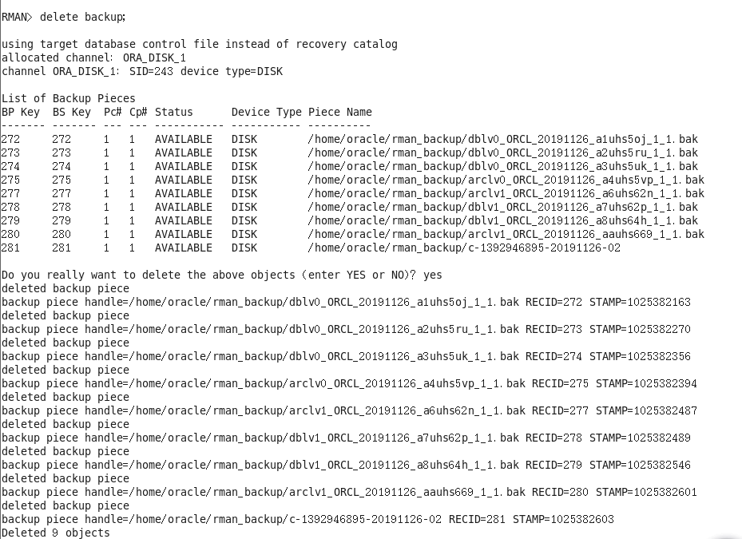

####5.2.5删除备份集之后，备份文件也删除了。只留下日志文件。

    [oracle@oracle-pc ~]$ cd rman_backup
    [oracle@oracle-pc rman_backup]$ ls

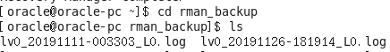

# 6总结

本次实验中，发现自己在Oracle方面有许多不足，虽然上课有听讲。但是发现有些知识点只有你自己运用之后，才会发现自己的理解不够，因此需要量的练习和操作，做到熟练，才能不用看课本就可以写一些基本的东西。
